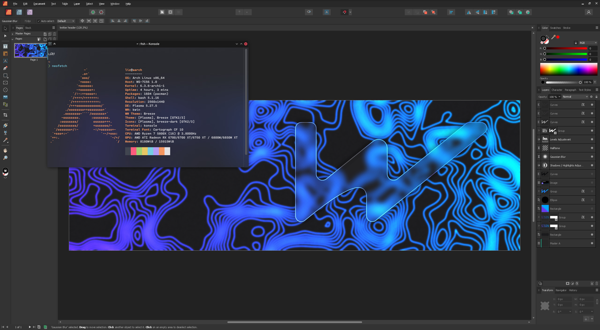

> Orginal image is from : https://codeberg.org/wanesty/affinity-wine-docs

# Build ElementalWarrior Wine In GitHub Action

Build ElementalWarrior's Wine using github action to run Affinity apps in linux

## Acknowledgements

 - [affinity-wine-docs](https://codeberg.org/wanesty/affinity-wine-docs)
 - [ElementalWarrior Wine](https://gitlab.winehq.org/ElementalWarrior/wine.git)

## Documentation

[Orginal Step By Step Documentation](https://codeberg.org/wanesty/affinity-wine-docs)
## How to setup the workflow

- Open the fork repo
- Click on `Actions`
- Enable the workflow
- Start the workflow called `Compile Affinity Wine`
- Now run the workflow
- After Workflow success, click on it
- In `Summary` section under `Artifacts` you get a file called `Affinity-Wine-Build-`
- Download and extract it
 

-  `Compile Affinity Wine (To Artifact )` To upload to build to github action's artifact section
- `Compile Affinity Wine (To Releases )` To upload to build to github releases section

## Appendix

:warning: **Github free user might get a warning about like this :point_down:**

_This step has been truncated due to its large size. Download the full logs from the menu once the workflow run has completed._
>But the build still continues

:warning:***If you have any display or graphics-related issues, try using it with the X11 session***